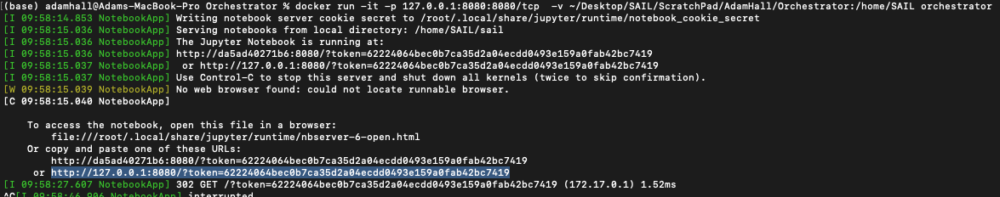
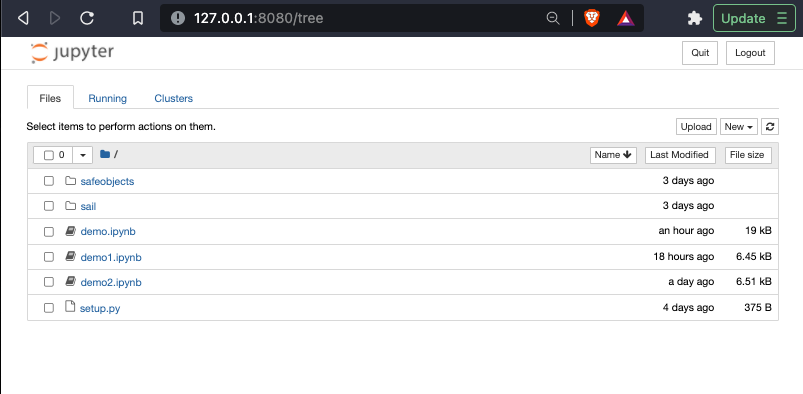

### 1. Preparing the Notebook

#### 1.1 Building the Image

First you need to build the docker image from the dockerfile in this directory. You'll need an access token for the secureailabs github. Build your docker image by running:

```
docker build --build-arg git_personal_token={your git access token}} -f Dockerfile -v ~/Documents/SAIL/ScratchPad/:/SAIL  -t orchestrator:0.2
```

#### 1.2 Containerising the Image

Next you need to containerise your image. We mount our a local volume to the container with the -v command. You need to write the absolute path to your current directory. If you don't know your absolute path, try the pwd command. This'll give you access to the sail packages and demo files held here from within the notebook container. The rest of the tutorial will be shown as if you mounted to this directory on your host. We're also going to map ports used by the notebook on our container to port 8080.

```
docker run -it -p 127.0.0.1:8080:8080  -v {path}/ScratchPad/:/SAIL orchestrator
```

#### 1.2 Running the Notebook

Run the jupyter notebook command below once you've started your container. You should be able to access your notebook on your host device on your browser at this address: https://127.0.0.1:8080. You'll need the token from your terminal output to access the page.

```
jupyter notebook --notebook-dir=/SAIL --ip=0.0.0.0 --port=8080 --allow-root
```




